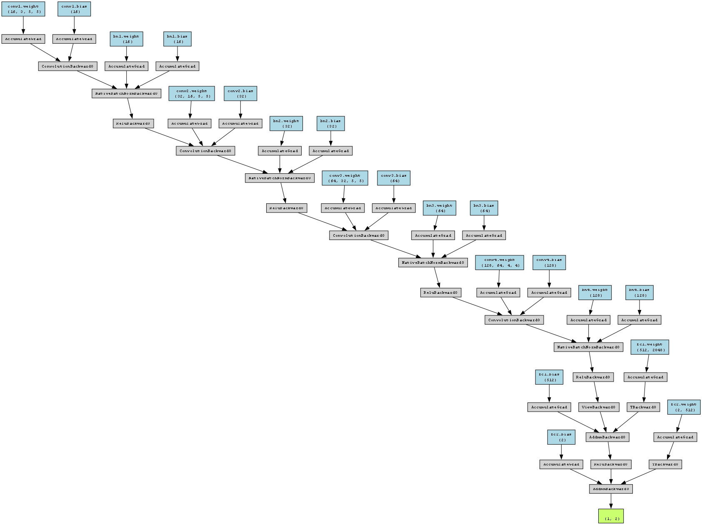

# AI-Generated Image Detection

[](https://github.com/annalaczko/ADL-AI-Generated-Image-Detection/actions/workflows/python-package.yml)


A CNN-based binary classifier that distinguishes **real human face photographs** from **AI-generated ones**, achieving **95.02% accuracy** on the 140k Real and Fake Faces dataset.

Built as part of the *Applied Deep Learning* course at TU Wien.

---

## Table of Contents

- [Overview](#overview)
- [Model Architecture](#model-architecture)
- [Results](#results)
- [Dataset](#dataset)
- [Project Structure](#project-structure)
- [Getting Started](#getting-started)
- [Usage](#usage)
- [Documentation](#documentation)
- [LLM Use](#llm-use)
- [References](#references)

---

## Overview

With the rapid rise of AI-generated images on social media, many users struggle to distinguish real photographs from synthetic ones. This project builds a lightweight CNN classifier focused on detecting AI-generated human faces — the category most commonly involved in misinformation and deepfakes.

Key design decisions (inspired by the CIFAKE paper):
- **Large kernel size (5x5):** captures fine-grained peripheral details, which the CIFAKE paper identified as the primary cue for detecting AI images
- **Strided convolutions instead of pooling:** avoids discarding spatial detail that the model relies on
- **Progressive channel doubling (16 → 32 → 64 → 128):** learns increasingly abstract feature representations
- **Batch normalisation after every conv layer:** stabilises training and improves generalisation

The preprocessing pipeline also supports generating **edge-detected** and **sharpened** versions of each image, intended for a future ensemble model that processes multiple filtered views of the same image simultaneously.

---

## Model Architecture

The network has 4 convolutional blocks followed by 2 fully-connected layers:



| Layer | Type | Channels | Kernel | Stride |
|-------|------|----------|--------|--------|
| conv1 | Conv2d + BN + ReLU | 3 → 16 | 5x5 | 2 |
| conv2 | Conv2d + BN + ReLU | 16 → 32 | 5x5 | 2 |
| conv3 | Conv2d + BN + ReLU | 32 → 64 | 5x5 | 3 |
| conv4 | Conv2d + BN + ReLU | 64 → 128 | 4x4 | 3 |
| fc1 | Linear + ReLU | flattened → 512 | — | — |
| fc2 | Linear (output) | 512 → 2 | — | — |

Input images are resized to **128×128 RGB** before being fed to the network. The model is trained with the Adam optimiser (lr=0.02) and a `ReduceLROnPlateau` scheduler, and includes early stopping with a patience of 3 epochs.

---

## Results

Evaluated on the held-out validation set (30% of the dataset, ~69,000 images):

| Metric | Value |
|--------|-------|
| Validation Accuracy | **95.02%** |

**Confusion Matrix:**

|  | True Real (0) | True Fake (1) |
|---|---|---|
| **Predicted Real (0)** | 18,076 | 511 |
| **Predicted Fake (1)** | 2,924 | 47,489 |

> **Note on generalisation:** After testing on independently sourced internet images, the model showed reduced performance — most likely due to data leakage in the original dataset (the model may have been picking up dataset-specific artefacts rather than genuine AI-generation signals). See [Report.md](Report.md) for a detailed discussion.

---

## Dataset

The model was trained on the [140k Real and Fake Faces](https://www.kaggle.com/datasets/xhlulu/140k-real-and-fake-faces/versions/1/data) Kaggle dataset:

- **Real faces:** sourced from Flickr via the FFHQ dataset
- **Fake faces:** generated by StyleGAN

A restructured version of the dataset (organised into `fake/` and `real/` subdirectories, ready for the preprocessing pipeline) is available [here](https://drive.google.com/drive/folders/1tqMOQfYcUJrGCt6cJPvw_NHCmXyN82Cj?usp=sharing).

The preprocessing pipeline (`Preprocess.py`) handles:
- Resizing to the target resolution with a random crop for variety
- Data augmentation (random crop + colour jitter) for the training set
- Optional edge detection and sharpening filters for ensemble experiments

---

## Project Structure

```
ADL-AI-Generated-Image-Detection/
│
├── NeuralNetworkDIY.py              # CNN architecture (ClassifierNetwork) and training wrapper (Model)
├── Preprocess.py                    # Image preprocessing and augmentation pipeline
├── test_NeuralNetworkDIY.py         # Unit tests for the model
├── test_Preprocess.py               # Unit tests for preprocessing
│
├── Notebook - Assignment 2.ipynb    # Main experiment notebook: training, evaluation, confusion matrix
├── Train_Final_Model.ipynb          # Trains the final model and saves it as ADL_model.pth
├── User Interface.ipynb             # Gradio-based interactive UI for real/fake classification
│
├── ADL_model.pth                    # Trained model weights
├── model_structure_high_quality.png # Model architecture diagram (generated by torchviz)
├── model_structure_high_quality.pdf # PDF version of the architecture diagram
│
├── Report.md                        # Full project report (all three assignment stages)
├── environment.yml                  # Conda environment definition
│
├── docs/                            # Sphinx documentation source + Python dependencies
│   └── requirements.txt             # pip requirements file
│
└── archive/                         # Earlier experimental notebooks kept for reference
```

---

## Getting Started

### 1. Clone the repository

```bash
git clone https://github.com/annalaczko/ADL-AI-Generated-Image-Detection.git
cd ADL-AI-Generated-Image-Detection
```

### 2. Install dependencies

```bash
pip install -r docs/requirements.txt
```

Or, if you prefer Conda:

```bash
conda env create -f environment.yml
conda activate jupyterlab
pip install -r docs/requirements.txt
```

### 3. Download the dataset

Download the preprocessed dataset from [this Google Drive link](https://drive.google.com/drive/folders/1tqMOQfYcUJrGCt6cJPvw_NHCmXyN82Cj?usp=sharing) and extract it into a `data/raw/` folder in the project root:

```
data/
└── raw/
    ├── fake/
    └── real/
```

---

## Usage

### Running the training notebook

Open `Notebook - Assignment 2.ipynb` to walk through the full pipeline: preprocessing, training, validation, and confusion matrix. This notebook also contains the saved outputs from the original training run.

To retrain the final model used by the UI, open and run `Train_Final_Model.ipynb`. It will save the trained model as `ADL_model.pth`.

### Running the UI

Open `User Interface.ipynb` and run all cells. A Gradio interface will launch in your browser. Upload a face image, use the built-in crop tool to isolate the face, and the model will return a **Real / Fake** prediction with a confidence score.

> The model was trained exclusively on close-up face images, so cropping is important for accurate predictions on photos from the wild.

### Running the tests

```bash
python -m unittest discover .
```

Tests run automatically via GitHub Actions on **Python 3.9, 3.10, and 3.11** on every push to `main`.

---

## Documentation

Full API documentation for `NeuralNetworkDIY.py` and `Preprocess.py` is available on Read the Docs:

**[View Documentation](https://adl-ai-generated-image-detection.readthedocs.io/en/latest/index.html)**

---

## LLM Use

ChatGPT was used during this project for:

- Debugging the `.ipynb` to `.py` conversion (missed function calls, typos)
- Test generation — first time writing Python unit tests
- Reformatting inline comments into Sphinx/ReadTheDocs docstring format
- General debugging and understanding error messages

---

## References

- Bird, J.J. & Lotfi, A. (2023). *CIFAKE: Image Classification and Explainable Identification of AI-Generated Synthetic Images.* [arXiv:2303.14126](https://arxiv.org/abs/2303.14126)
- Xi, Z. et al. (2023). *AI-Generated Image Detection using a Cross-Attention Enhanced Dual-Stream Network.* [paperswithcode](https://paperswithcode.com/paper/ai-generated-image-detection-using-a-cross)
- Lu, Z. et al. (2023). *Seeing is not always believing: Benchmarking Human and Model Perception of AI-Generated Images.* [paperswithcode](https://paperswithcode.com/paper/seeing-is-not-always-believing-benchmarking)
- Krizhevsky, A. & Hinton, G. (2009). *Learning multiple layers of features from tiny images.*
- 140k Real and Fake Faces dataset: [Kaggle](https://www.kaggle.com/datasets/xhlulu/140k-real-and-fake-faces/versions/1/data)

---

*Grammar and phrasing refined with Grammarly.*
